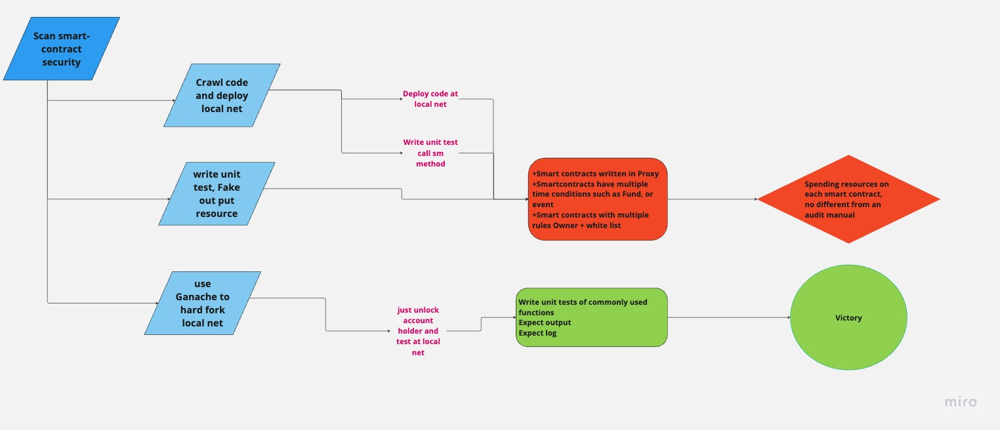

# Overview

The goal of this project is to develop a tool or system that can scan smart contracts for security vulnerabilities
The project will require significant expertise in smart contract development and blockchain technologies, as well as programming languages commonly used for smart contracts, such as Solidity. It may also require collaboration with security experts and blockchain developers to ensure that the system is effective and meets the needs of the community.



# Smartcontract unit test

#### Step 1. Start local net and fork to mainnet(ethereum network group like ETH, BSC, Polygon).

`ganache-cli --fork https://mainnet.infura.io/v3/${private_key} --secure -u 0 -u {holder_address}`

+ private_key is infura private key, you can get this one from Infura page. [read more](https://blog.infura.io/post/getting-started-with-infura-28e41844cc89?utm_source=community&utm_medium=referral)

+ holder_address is a smart-contract holder address that has Token balance and Native token to pay gas test transactions. You can send gas to this address at the local net before testing if you want

USDT Ex:

```
ganache-cli --fork https://mainnet.infura.io/v3/794e26a10b812376969123bed1876d9c --secure -u 0 -u 0xb842afd82d940ff5d8f6ef3399572592ebf182b0
```

#### Step 2. Update .env
```
#Smart-contract testing address
SM_ADDRESS=0x*****b842afd82d940ff5d8f6ef3399572592*****

#Holder address
HOLDER_ADDRESS=0x*****b842afd82d940ff5d8f6ef3399572592*****

#Holder address
SCANNER_PRIVATE_KEY=***3A6XK1CQXY6BAV1UYFEHSAAAAAAA***
```
+ You can find all information from ether scan. [readmore](https://docs.etherscan.io/getting-started/viewing-api-usage-statistics)

#### Step 3. Run command line test
```
# full test
yarn test
```
or 
```
# specific file like wallet_scan.test.ts
yarn test wallet_scan.test.ts
```

The script will scan the famous functions which using in your like system.
```
+ balanceOf
+ transfer
+ transferFrom
+ allowance
+ approve
+ balanceOf
```
[example](https://etherscan.io/address/0x5a98fcbea516cf06857215779fd812ca3bef1b32#code)
The result of unitest is not mean this smart contract is safe or not, and  is not a substitute for manual scanning. It just provice more information to scanner. Scanner can use this info to more focus on the not pass functions and save time.

# Smartcontract manual test

It is the most important task, the scanner needs to collect smart-contract code (no Proxy, or third-party SM). You can use CrawlSMCode function if you need to collect a list smart-contract code

```
yarn crawl
```

#### Step 1. 
Scanner need to check overview first, make sure this SM follow the standard of smart contract like Openzeppelin or other big Labs.
some finance logic need to check at this step like: 
```
mint
burn
totalSupply
maximumTotalSupply. 
```
[example](https://etherscan.io/address/0x5a98fcbea516cf06857215779fd812ca3bef1b32#code)
If the Mint function or Burn function exist in smart-contract code that mean the totalSupply of this smartcontract can be chang. In that case, you need to check mint function has logic to check totalSupply allway less than maximumTotalSupply.
The mint or burn functionneedso grand access, onlyexecutede by Owner or Admin list.

#### Step 2.
Scanner forcus on famous functions like Unit test part - step 3
a lot of smart-contract have magic logic that can make the master issue for your system 
+ Stuck function like Can not collect balance from user wallet because transferFrom is not working .etc
+ Loss of balance of Mother wallet or President wallet because smart-contract government will take tax fee when we execute withdraw transaction .etc

The scanner needs to collect full information about the strange logic, risk, and anything's can affect to your system

# END